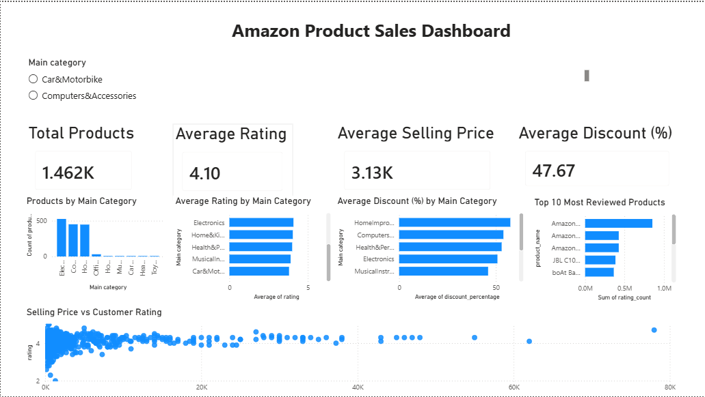

# 📊 Amazon Product Sales Dashboard

An interactive Power BI dashboard built to analyze Amazon product data. This project demonstrates the complete data analytics workflow—from raw data cleaning in Python to creating an interactive dashboard in Power BI.

---

## 🚀 Project Overview

The goal of this project was to transform raw Amazon product data into meaningful business insights.

The workflow includes:
- Cleaning and preprocessing the raw dataset using Python (Pandas)
- Preparing the data for analysis
- Building an interactive Power BI dashboard
- Identifying key business insights through data visualization

---

## 🛠️ Tools & Technologies

- **Power BI**
- **Python**
- **Pandas**
- **CSV Dataset**

---

## 📁 Project Structure

```
amazon-product-sales-dashboard/
│
├── Amazon_Product_Sales_Dashboard.pbix
├── README.md
│
├── data/
│   ├── amazon_raw_data.csv
│   ├── amazon_cleaned_data.csv
│   └── data_cleaning.py
│
└── screenshots/
    └── dashboard.png
```

---

## 📊 Dashboard Features

- KPI Cards
  - Total Products
  - Average Customer Rating
  - Average Selling Price
  - Average Discount (%)

- Category-wise Product Analysis

- Average Rating by Category

- Average Discount by Category

- Top 10 Most Reviewed Products

- Selling Price vs Customer Rating Analysis

- Interactive Category Slicer

---

## 📸 Dashboard Preview

> Add your dashboard screenshot below.



---

## 💡 Key Insights

- Electronics contains the highest number of products in the dataset.
- Office Products has the highest average customer rating.
- Home Improvement products receive the highest average discount percentage.
- A small number of products account for the majority of customer reviews.
- Selling price does not show a strong relationship with customer ratings.

---

## 🧹 Data Cleaning

The dataset was cleaned using Python before importing it into Power BI.

Cleaning steps included:

- Removing unnecessary columns
- Handling missing values
- Converting prices, ratings, and discounts to numeric values
- Removing special characters from currency fields
- Preparing the dataset for visualization

---

## 📈 Skills Demonstrated

- Data Cleaning
- Data Transformation
- Data Visualization
- Dashboard Design
- Business Analysis
- KPI Creation
- Interactive Filtering
- Power BI Reporting
- Python (Pandas)

---

## 🎯 Future Improvements

- Add DAX measures for advanced KPIs
- Include drill-through pages
- Add custom tooltips
- Create additional analytical dashboards using different datasets

---

## 👨‍💻 Author

**Rahul Walawalkar**


-  GitHub: [raahu11](https://github.com/raahu11)
-  LinkedIn: [Rahul Walawalkar](https://www.linkedin.com/in/rahul-walawalkar-ab9589385)

---

## ⭐ If you found this project useful, consider giving it a star!
